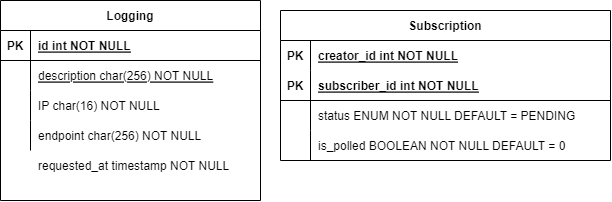

# Tugas Besar 2 IF3110 - HaBeDe - Binotify SOAP Service
## Deskripsi Web Service

*Web service* pada *repository* ini dibuat sebagai *web service* SOAP untuk aplikasi Binotify. *Service-service* yang dilakukan antara lain adalah: menjaga *security* dari aplikasi Binotify; menerima permintaan *subscription* dari Binotify App, mengirim *callback* penerimaan/penolakan permintaan *Subscription* ke Binotify App, serta menyediakan *endpoint* *Check Status* permintaan.

## Skema Basis Data
 

## Pembagian Tugas
* Security: `13520154` 
* Menerima Permintaan *Subscription*: `13520133, 13520154` 
* *Check Status* Permintaan: `13520154, 13520160` 
* Menerima Penerimaan/Penolakan Permintaan *Subscription*: `13520154, 13520160` 